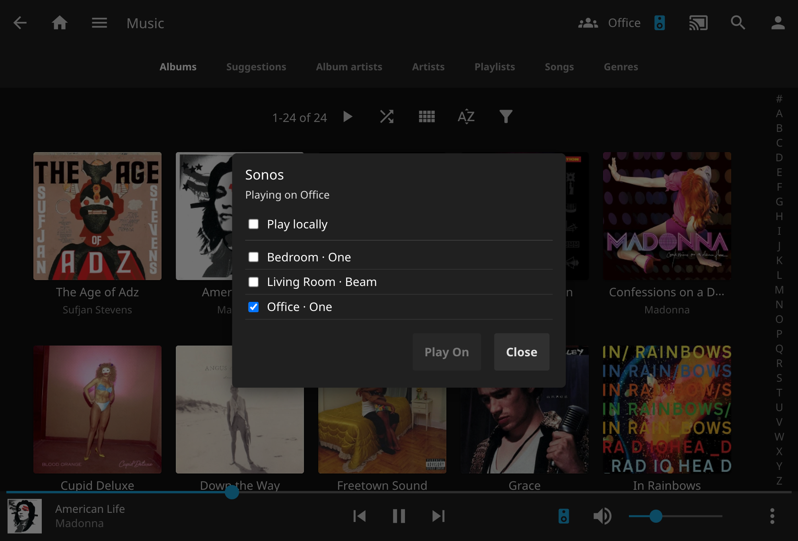

# Jellyfin Sonos Plugin

A Jellyfin **10.11** plugin that discovers Sonos **S2** speakers on the LAN and enables direct streaming from Jellyfin to Sonos. It includes auto speaker discovery, grouping, updates to the Jellyfin web UI and a comprehensive API.



## Target server


|                 |                                                       |
| --------------- | ----------------------------------------------------- |
| Jellyfin        | 10.11.x (`targetAbi` 10.11.0.0)                       |
| Packages        | `Jellyfin.Controller` / `Jellyfin.Model` **10.11.11** |
| Framework       | `net9.0`                                              |
| Sideload folder | `$JELLYFIN_ROOT/data/plugins/Sonos_<version>/`        |


## Build

Requires the [.NET 9 SDK](https://dotnet.microsoft.com/download/dotnet/9.0).

```bash
dotnet build -c Release
dotnet test -c Release
```


## Install

### Plugin repository

1. Dashboard → Plugins → Repositories → Add, and paste:

   `https://raw.githubusercontent.com/adamdunkley/jellyfin-plugin-sonos/main/manifest.json`

2. Dashboard → Plugins → Catalog → find **Sonos** → Install.
3. Restart Jellyfin.

The catalog lists GitHub Releases. After a tagged release (`v0.1.0.0` and matching versions in `Directory.Build.props` / `build.yaml`), Catalog can install that version.

### Sideloading

Set `JELLYFIN_ROOT` to the Jellyfin config directory (the folder that contains `data/plugins`), then run:

```bash
JELLYFIN_ROOT=/path/to/jellyfin ./scripts/sideload.sh
```

That publishes the plugin and copies `Jellyfin.Plugin.Sonos.dll` plus `meta.json` to `$JELLYFIN_ROOT/data/plugins/Sonos_<version>/`. Restart Jellyfin afterwards. Dashboard → Plugins should list **Sonos**.

Do not commit built DLLs.

## HTTP API

Authenticated Jellyfin clients (official apps, third-party UIs, scripts) can list S2 speakers, group rooms, play the music library, and control transport under `/Sonos`. The injected web UI uses the same routes. Contract, auth, and examples: **[API.md](API.md)**.

## Seed player IPs (primary discovery)

Multicast SSDP/mDNS is unreliable when Jellyfin cannot see LAN broadcasts (for example a Docker bridge). **Seed player IPs** in the config page are the reliable path in that case:

1. Put the speaker LAN IP(s) in **Seed player IPs** (comma-separated).
2. Wait up to 30 seconds (or restart Jellyfin).
3. `GET /Sonos/Players` should show name, model, RINCON, IP, and group.

The plugin also unicast-probes `:1400` (UPnP device description + `GetZoneGroupState`) and `https://{ip}:1443/api/v1/players/local/info` (S2 LAN API, TLS without cert validation). S1 speakers (`SWGen=1` or no 1443 API) are logged and omitted. Invisible satellites are skipped. SSDP M-SEARCH is best-effort from an ephemeral UDP port and **never** binds 1900.

If a RINCON moves to a new DHCP address, the registry overwrites `Ip`. Players unseen for three discovery cycles are marked unavailable.

## Published base URL

Speakers must HTTP-GET audio and Cloud Queue from an address **they** can route to. Set **Published base URL** to a LAN HTTP origin the speakers can reach, including any server base path, for example:

```
http://192.0.2.10:8096/media
```

Playback fails with `PublishedUrlInvalid` when this is missing, loopback (`127.0.0.0/8`), link-local (`169.254/8`), or a Docker-bridge address (`172.16.0.0/12`).

Do not use:

- `localhost` / `127.0.0.1`
- a container or Docker-bridge IP
- a reverse-proxy HTTPS hostname unless the speaker can complete TLS and path routing to that URL


## LAN authentication (403)

Current Sonos apps expose a privacy toggle for third-party **LAN** integrations. If players appear but commands return `LanAuthRequired` / HTTP 403:

1. In the Sonos app, allow third-party LAN control (disable the LAN authentication / privacy lock).
2. Confirm the speaker is S2 and reachable on TCP 1443 / 1400 from the Jellyfin host.

No Sonos developer key is required. The LAN API uses the well-known local token (same as [aiosonos](https://github.com/music-assistant/aiosonos)). SOAP AVTransport is a last-resort fallback when the LAN WebSocket cannot connect; native Cloud Queue is the S2 happy path.

## Docker / networking

If Jellyfin runs in Docker, multicast discovery usually needs host networking or seed IPs inputting manually to discover Sonos speakers.

- Speakers need L2/L3 reachability to the published HTTP URL.
- Inter-VLAN mDNS/SSDP needs a reflector; that is out of scope.
- UniFi: mDNS and IGMP snooping quirks are a common false “plugin is broken.”
- Firewall: speakers initiate HTTP to Jellyfin; the plugin initiates HTTP/WebSocket to the speaker.
- HTTPS: speakers fail TLS against a private CA. LAN HTTP is the pragmatic default.


## DLNA coexistence

This plugin does not use generic DLNA Play To for S2. The official Jellyfin DLNA plugin may still list the same speakers as separate Play To devices.

## Web UI

Hard-refresh jellyfin-web after install so the injected client loads.

Speakers appear in the usual **Cast / Play on** menu. A speaker button next to the cast icon (and on the now-playing bar) groups rooms, then **Play on**. Stock play/pause/skip/seek/volume controls the Sonos queue; disconnect to play in the browser again.

Playback still needs **Published base URL** and **Seed player IPs**. Set **Default user** for unattended Play To.

## Config page

Dashboard → Plugins → Sonos:


| Setting                   | Purpose                                            |
| ------------------------- | -------------------------------------------------- |
| Enabled                   | Stop discovery and playback                        |
| Default user              | Fallback user when there is no HTTP user (Play To) |
| Published base URL        | URL speakers use (required for playback)           |
| Seed player IPs           | Unicast discovery when multicast fails             |
| Preferred transcode codec | `flac` (default) / `aac`                           |
| Ignored player IDs        | Never expose or control                            |
| Verbose protocol logging  | Jellyfin log; no tokens or API keys                |


## LLM disclosure

This plugin was developed with assistance from Large Language Models but all output has been audited by the repo creator.